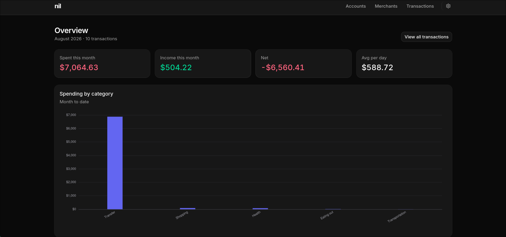
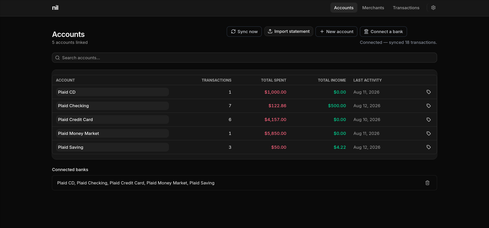
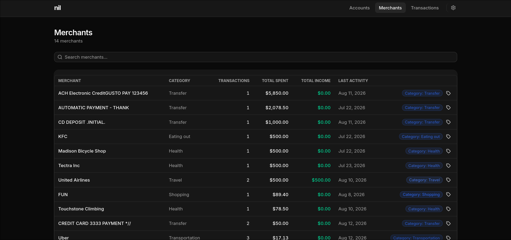
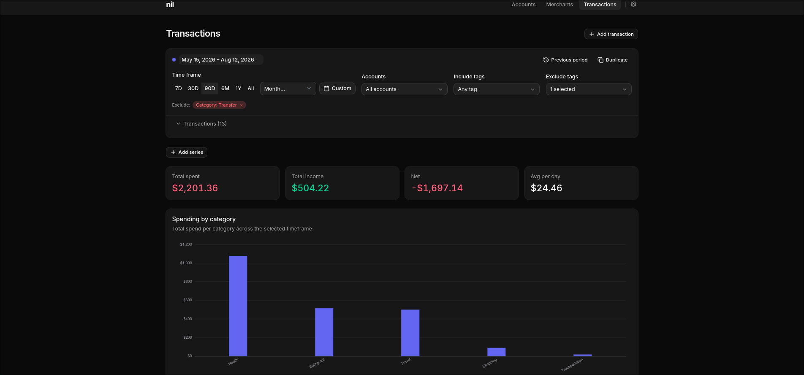
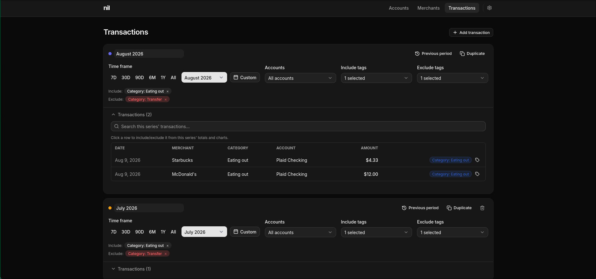
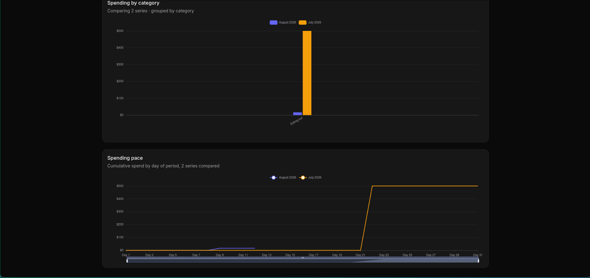

[](https://github.com/jdeinum/budget_backend/actions/workflows/check.yaml)
[](https://github.com/jdeinum/budget_backend/actions/workflows/test.yaml)
[](https://github.com/jdeinum/budget_backend/actions/workflows/audit.yaml)

# Nil

Nil is a personal finance tracker I built to replace [YNAB](https://www.ynab.com/) / [Monarch](https://www.monarchmoney.com/)
without paying 15$ per month. Currently I just host this on my server at home,
but I am planning to deploy this at some point so others could use it. 

This is the backend — the SvelteKit frontend lives in a separate repo:
[budget_frontend](https://github.com/jdeinum/budget_frontend).

## Features

Roughly in the order data flows through the app — in, organized, then analyzed:

- Connect a bank/card via Plaid Link, with an initial sync plus incremental
  syncing on the item's own cursor
- Manual accounts and hand-entered transactions for anything Plaid doesn't
  cover
- CSV statement import for Neo and Amex, safe to re-run over an overlapping
  date range — already-imported rows are skipped, not duplicated
- Tags: free-form key/value pairs on accounts, merchants, and transactions,
  with account < merchant < transaction precedence on conflicts
- Ignore rules (by merchant match, tag, account, or transfer pair), built on
  top of tags/accounts, that retroactively re-evaluate whenever a rule or tag
  changes
- Paginated, sortable, full-text-searchable transaction listing with tag
  filters
- Series-based comparisons for spending/income over any matching time window

## Screenshots

**Home** — this month's spend/income/net at a glance, plus spending by category.



**Accounts** — linked Plaid accounts and manually-created ones side by side,
with sync, statement import, and new-account actions.



**Merchants** — every merchant seen so far, deduped and auto-tagged by
category, with per-merchant totals.



**Transactions** — the core view: build one or more series (time range,
accounts, tags), inspect their line items, then compare series side by side.





## Data Model

I think the only worthwhile detail talking about with regards to the backend is
how the data model. I wanted to keep it as simple as possible, while still
allowing for detailed analysis. Here is roughly the shape:

1. An account is the thing that money moves to or from, typically owned by you
2. A merchant is a named account that we do not manage
3. A transaction is a transfer of money from one account to another

That's it for the financial specific ones. 

For categorizing and analysis, Nil has the concept of tags, which are just key
value pairs placed on any of the above entities. The hierarchy for tags is
accounts < merchants < transactions , so with conflicting values, the
transaction always wins because its the most granular. 

In terms of visualizing, Nil just represents data sets as Series, which is just
a data set over some period. As long as the time frame matches, you can really
compare anything. See the images for some examples.

## Getting Started

### Prerequisites

- [Rust](https://rustup.rs/) (version pinned in `rust-toolchain.toml`)
- A Plaid developer account (sandbox is enough) — only needed for the
  `/plaid/*` routes; everything else (accounts, manual transactions,
  statement imports, tags, rules) works without it
- [Doppler](https://doppler.com) (optional — `justfile`'s `dev`/`prod`
  recipes read secrets from it; copy `.env.example` to `.env` instead if you
  don't use it)

### Setup

```sh
cp .env.example .env   # fill in BUDGET__PLAID__CLIENT_ID / BUDGET__PLAID__SECRET
cargo run               # or: just dev   (via Doppler)
```

Migrations run automatically on startup against `data/budget.db` (created if
missing). The server listens on `config/default.toml`'s `server.host`/
`server.port` (`0.0.0.0:3000` by default) — override with `BUDGET__SERVER__*`
env vars, same double-underscore convention as the Plaid credentials.

## Testing

```sh
cargo nextest run
```

Runs the unit tests plus `tests/api`'s integration suite, which spins up the
real app (`budget::build`, same code path `main.rs` uses) against a
throwaway SQLite file and a mocked Plaid API, and drives it over real HTTP.

Two kinds of tests are opted out of that default run, since each trades
speed for something the fast suite doesn't need on every `cargo test`:

- **Property tests** (`quickcheck`) — check pure-function invariants (cursor
  encode/decode round-trips, tag-layer merge ordering, description
  normalization) against ~100 generated inputs each, instead of a handful of
  hand-picked examples. Skipped by default; opt in with:
  ```sh
  PROP_TEST=1 cargo nextest run
  ```
- **Snapshot tests** (`insta`) — the Amex/Neo statement parsers' "parses the
  real export" tests assert against a committed `.snap` file rather than
  hand-picked fields, so a parser change that touches _any_ field shows up as
  a diff. If a change is intentional, review and accept it:
  ```sh
  cargo install cargo-insta
  cargo insta review
  INSTA_UPDATE=always cargo test
  ```

## Roadmap

- ⬜ Cloudflare Workers port - swap the embedded SQLite file (`sqlx` +
  `sqlite://data/budget.db`) for [Cloudflare D1](https://developers.cloudflare.com/d1/) and run the API as a worker.
- ⬜ OAuth - no authentication exists yet; the API isn't publicly reachable
  today, only called by the frontend over a private Docker network
- ⬜ WASM plugin model - client driven code that only accesses the data you want
  it to, and sandboxed to prevent accessing your system in unexpected ways
